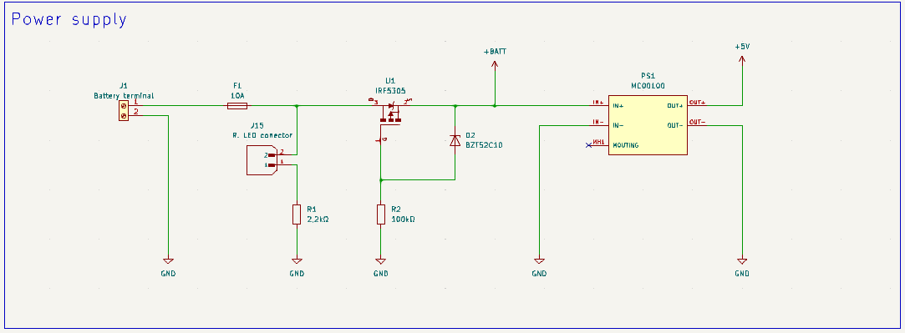
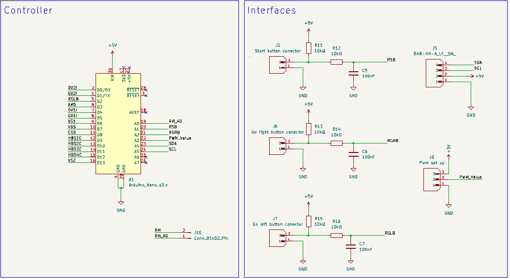
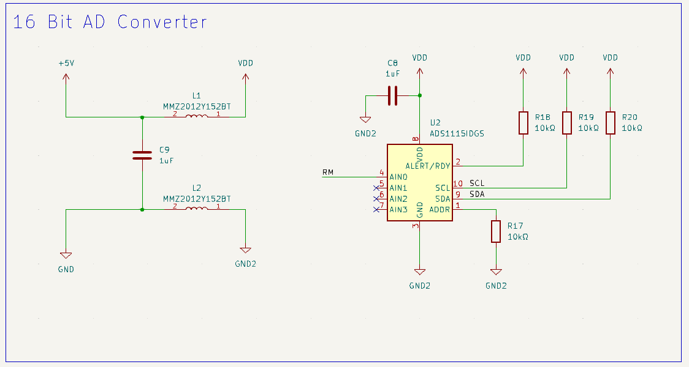
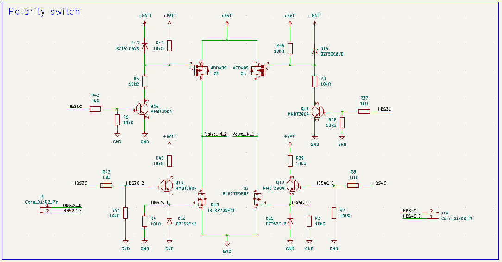
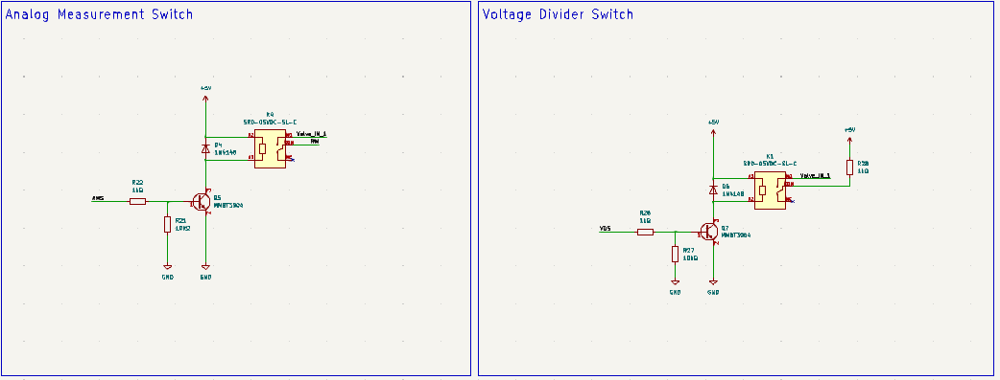
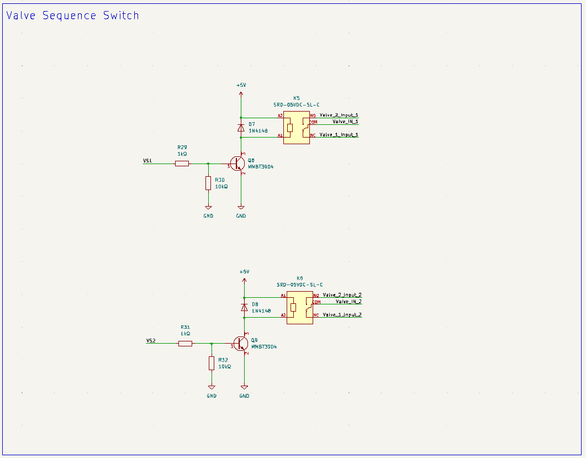
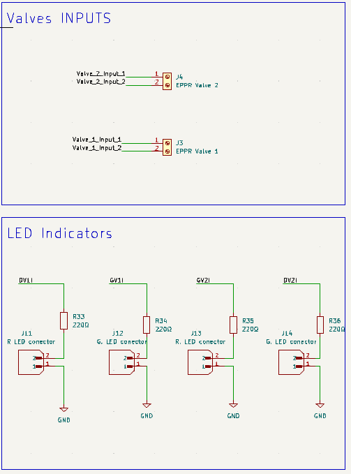

# Elektronikus nyomáscsökkentő szelep tesztelő

## Megvalósítandó funkciók

### 1. Mérési funkciók 
* **Szelepek folytonosságának mérése:** Gyors szakadás- és zárlatvizsgálat a szelepek tekercsén.
* **Nagy pontosságú ellenállásmérés:** A szelepek tekercsellenállásának precíziós mérése **0,1%-os pontossággal**, ami lehetővé teszi a minimális menetzárlatok vagy degradációk kiszűrését is.
* **Többcsatornás architektúra:** A rendszernek alkalmasnak kell lennie egyszerre két szelep fogadására és mérésére/tesztelésére.

### 2. Vezérlési és hajtás funkciók 
* **Teljes kivezérlés:** A szelepek direkt, folyamatos (100%-os) kivezérlése a maximális elmozdulás és működés ellenőrzéséhez.
* **PWM kivezérlés:** Impulzusszélesség-modulált (PWM) jel biztosítása a proporcionális szelepek áram- és nyomásszabályzási karakterisztikájának teszteléséhez.
* **Polaritásváltás (H-híd konfiguráció):** A hardvernek felkészültnek kell lennie a polaritás szoftveres felcserélésére, biztosítva a jövőbeli kompatibilitást a többállású vagy irányváltó szelepekkel.

### 3. Hardver és elektromos védelem 
* **Széles tápfeszültség-tartomány:** Az áramkörnek stabilan kell üzemelnie **12V és 24V DC** közötti betáplálási feszültségen, alkalmazkodva az ipari és járműipari szabványokhoz.
* **Fordított polaritás elleni védelem:** Védelem a tápvezetékek téves felcserélése ellen a belső elektronika megóvása érdekében.
* **Túláramvédelem:** A fő tápágat egy **10A-es biztosíték** védi a zárlatokból vagy túlterhelésekből adódó károk ellen.

### 4. Felhasználói felület és szoftver 
* **Beépített menürendszer:** A műszernek rendelkeznie kell egy lokális kijelzőn és fizikai nyomógombokon keresztül kezelhető, jól strukturált menürendszerrel. A szoftvernek kötelezően biztosítania kell az alábbi dedikált menüpontokat:
  * **Teljes teszt:** Egy automatizált tesztszekvencia, amely felhasználói beavatkozás nélkül, egymás után elvégzi a szakadásvizsgálatot, az ellenállásmérést, és végül teljesen kivezérli a szelepet.
  * **Szakadásvizsgálat:** Külön menüpont a tekercs folytonosságának gyors és célzott ellenőrzésére.
  * **Ellenállásmérés:** Dedikált funkció a szelep tekercsellenállásának precíziós mérésére.
  * **Teljes kivezérlés:** A szelep 100%-os, folyamatos statikus meghajtása az azonnali működés-ellenőrzéshez.
  * **PWM kivezérlés:** Impulzusszélesség-modulált (PWM) jel kiadása a szelep proporcionális mozgásának teszteléséhez.
  * **Beállítások:** Rendszerkonfigurációs menü, ahol a felhasználó megadhatja a tesztelt szelepek számát, illetve kiválaszthatja a kívánt nyelvet.
* **Többnyelvűség:** A szoftver képesnek kell lennie több nyelv (Magyar, Angol, Német) dinamikus kezelésére és tartós tárolására.A műszernek újraindítás után is megkell jegyeznie az elmentett szelepek számát, illetve a beállított nyelvet

##  Kiválasztott hardverkomponensek 

A projekt áramköri kialakítása során a fő szempont a megbízhatóság, a költséghatékonyság, valamint az ipari (12-24V) környezetnek való megfelelés volt. Az áramkör az alábbi főbb alkatrészekre épül:

### 1 Vezérlés és Megjelenítés
* **Arduino Nano (ATmega328P):** Költséghatékony, könnyen programozható, és az I/O lábszáma, valamint a számítási kapacitása tökéletesen elegendő a műszer funkcióinak (állapotgép, I2C kommunikáció, PWM) ellátására.
* **16x4 LCD kijelző (I2C modullal):** A teszteredmények és a menürendszer megjelenítéséért felel. Az I2C bővítőnek köszönhetően mindössze két adatvonalat (SDA, SCL) igényel, így rengeteg portot spórol meg a mikrokontrolleren, és a programozása is rendkívül egyszerű.
### 2 Precíziós Mérésadatgyűjtés
* **ADS1115 (16-bites ADC):** A mikrokontroller beépített, alacsonyabb felbontású analóg-digitális átalakítója helyett ez a dedikált IC garantálja a rendkívül pontos (akár 0,1%-os) áram- és feszültségmérést.
* **LM317 feszültségszabályzó (Áramgenerátoros módban):** A precíziós ellenállásmérés alapja. Stabil, állandó mérőáramot biztosít a szelepek tekercsére, ami elengedhetetlen a pontos ellenállás kiszámításához.
* **Feszültségosztó hálózat:** Egy dedikált, egyszerű és gyors mérőáramkör a tekercsek folytonosságának azonnali ellenőrzésére.
### 3. Teljesítményvezérlés és Tápellátás
* **LM2596S DC-DC Step-down konverter:** A műszer tápegysége. A széles ipari feszültségtartományt (12V - 24V) hatékonyan és biztonságosan alakítja át a logikai áramkörök számára szükséges 5V-os stabil feszültségre.
* **AOD409 (P-csat) és IRLR2705 (N-csat) MOSFET-ek:** Ezek a nagy áramtűrésű tranzisztorok felelnek a szelepek (H-híd topológiájú) meghajtásáért. Biztosítják a biztonságos, melegedésmentes PWM szabályozást és a folyamatos, 100%-os kivezérlést a legnagyobb áramfelvételű szelepek esetén is.
* **SRD-05VDC-SL-C 5V Relék:** Mechanikus kapcsolóelemek, amelyek a különböző mérési körök (pl. áramgenerátoros mérés és PWM hajtás) fizikai és galvanikus leválasztását végzik, védve ezzel az érzékeny mérőelektronikát a tesztelés során.
### 4. Mechanika és Csatlakozók
* **JST XH csatlakozók a PCB-n:** A kijelző, a nyomógombok és a potenciométerek nem közvetlenül a panelre vannak forrasztva, hanem szabványos XH csatlakozókkal csatlakoznak. Ez drasztikusan megkönnyíti az alkatrészek cseréjét, valamint sokkal nagyobb szabadságot ad a végleges műszerház (enclosure) 3D tervezésénél és összeszerelésénél

## Részletes Áramköri Felépítés

Mivel a teljes kapcsolási rajz A3-as méretű, a könnyebb átláthatóság és olvashatóság érdekében funkcionális blokkokra bontva mutatjuk be a hardver működését.

A teljes rajz letölthető [**PDF formátumban**](Hardware/EPPR_tester_full.pdf)

### 1. Tápellátás és Fordított Polaritás Elleni Védelem
Ez a modul felel a rendszer stabil feszültségellátásáért. A 24V-os bemenetet egy biztosíték és egy dióda védi a fordított polaritás ellen. Egy **LM2596S** kapcsolóüzemű szabályzó állítja elő a logikai áramkörök számára szükséges stabil 5V-ot nagy hatásfokkal.

### 2. Vezérlő interfészek és Felhasználói Felület csatlakozók
Itt látható az **Arduino Nano** mikrokontroller központi bekötése. Ez a modul kezeli az I2C buszt az LCD kijelzőt és az ADC-t. Tartalmazza a JST XH csatlakozók bekötését a navigációs nyomógombokhoz, a potméterhez.

#### 3. Precíziós Analóg-Digitális Átalakítás (ADC)
A nagy pontosságú mérésekért egy **ADS1115** 16-bites külső ADC modul felel. I2C buszon kommunikál a vezérlővel.

### 4 Polaritás váltó híd 
Ez az áramkör tartalmazza a polaritás váltást az adott kimeneten, illetve kezeli hogy 12V illetve 24V-ről is tudjon működni.

### 5 Mérési Mód Választó Relé (AM / VD Switch)
Ez a modul választja ki, hogy az ADC éppen az analóg mérőjelet vagy a folytonossági teszthez szükséges feszültségosztót olvassa be.

### 6 Szelep Szekvencia Választó Relék (Sequence Switch)
Ez a rész kapcsolja a kimenetet, ezzel a kapcsolással egyszerre két szelep is rácsatlakoztatható és külön külön lemérhető.

### 7 Szelep Csatlakozók és Állapotjelző LED-ek
Ez a kimeneti modul tartalmazza a fizikai sorkapcsokat a szelepek bekötéséhez. Tartalmazza az optikai visszajelzést biztosító LED csatlakozását amelyek mutatják az adott szelep kimenet állapotát.

## Nyomtatott Áramkör 

A megbízható és zajmentes ipari működés érdekében a NYÁK-tervezés során az alábbi tervezési irányelveket követtem:

* **4 rétegű felépítés:** A panel ipari szabványú **FR-4**-es hordozóanyagra készült, 4 rétegű kialakítással. Ez lehetővé tette a jelvezetékek és a tápvezetékek optimális szétválasztását.
* **Dedikált Föld és Táp síkok:** A kiváló zajvédelem érdekében a két belső réteg dedikált feladatot kapott. Az egyik egy megszakítás nélküli, masszív Föld-sík, a másik pedig egy egybefüggő Táp-sík (5V). Ez minimalizálja a hurok-induktivitást és stabil referenciát biztosít a precíziós analóg mérésekhez.
* **Áramra méretezett vezetősávok:** A teljesítményelektronikai részeknél a vezetősávok szélessége a maximális átfolyó áramra lett méretezve a melegedés és a feszültségesés elkerülése végett.
* **Zajszűrés optimalizálása:** A tápszűrő kondenzátorok fizikailag a lehető legközelebb kerültek az integrált áramkörök (Arduino Nano, ADS1115, LM317) táplábaihoz, így hatékonyan nyelik el a magas frekvenciás tranzienseket.
* **Adatvonalak árnyékolása:** A kritikus kommunikációs vonalak (például az I2C busz SDA és SCL vonalai) a rézrétegen mindkét oldalról föld-sávokkal lettek körbevéve. Ez a technika drasztikusan csökkenti az áthallást és megvédi az érzékeny digitális jeleket a relék által keltett zavaroktól.
* **Precíziós Analóg Tápszűrés:** Az **ADS1115** 16-bites ADC tápellátását egy dedikált ferrit szűrővel választottuk le a közös 5V-os digitális tápvezetékről. Ez a szűrőmegoldás hatékonyan blokkolja a mikrokontroller és a digitális kapcsolóelemek által keltett nagyfrekvenciás zajokat, így garantálja a zajmentes tápfeszültséget az ADC számára, ami elengedhetetlen a 0,1%-os mérési pontosság eléréséhez.

## 3D Modell

A nyomtatott áramkörről és a rászerelt alkatrészekről egy teljes 3D modell készült. Ez a modell alapvető fontosságú a műszer külső dobozolásának megtervezéséhez, az ütközések ellenőrzéséhez, valamint a gombok és a kijelző pontos pozicionálásához.

**A NYÁK 3D-s látványterve (Render):**
[**Kattints ide a panel interaktív 3D megtekintéséhez!**](3D_models/eppr_tester.stl)

## Fizikai Összeépítés és Prototípus

Az alábbi képen a már legyártott, 4 rétegű **FR-4**-es nyomtatott áramkör látható a valóságban, készre szerelt állapotban. 

**A kész, működőképes áramkör a valóságban:**

